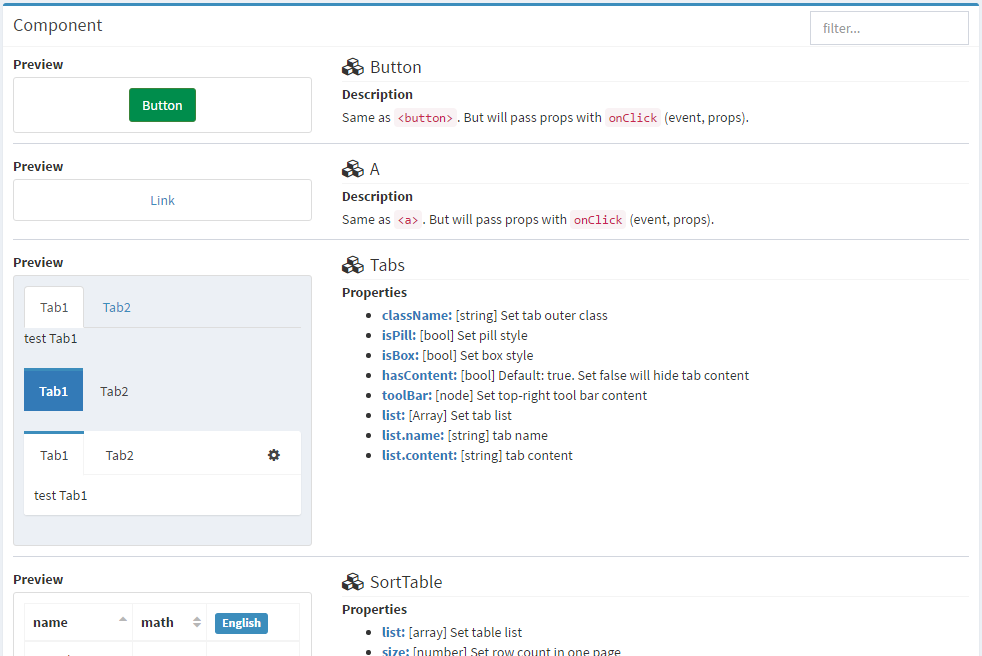

# React Component
Fairy React web component project.
It used in [AdminLTE](https://almsaeedstudio.com/themes/AdminLTE/index.html) style.
Online preview please click [here](https://cpp1992.github.io/fairy/).

PS: latest version please check tag of this repo.

## User Guide
### How to use?


**Taobao NPM registry usage:**

1. you should change the yarn config default registry:
      yarn : `yarn config set registry http://registry.npm.taobao.org/`, then change the file .yarnrc directly
      npm : `npm config set registry http://registry.npm.taobao.org/ --global`
  (To check if you'v changed registry : yarn config get registry &&  npm config get registry )
   you can also use `yarn config get` to chanege the file `.npmrc`  directly.
2. add in `package.json`:
```json
...
  "dependencies": {
    "admin-lte": "^2.3.8",
    "fairy": "1.0.1",
    ...
  }
...
```

**Github usage:**
Add fairy github ssh URL  in `package.json`:
```json
...
  "dependencies": {
    "admin-lte": "^2.3.8",
    "fairy": "git+ssh://git@github.com:cpp1992/Fairy.git#v1.0.1",
    ...
  }
...
```

**After finishing one of above,next is the same:**

Resolve dependency:  
```npm install```


----------


**Possible Problems(npm install) :**

 1. If you use `NPM registry usage`,  `node-sass` may could not init successfully beacuse taobao registry doesn't have this module,you can use `npm config set registry http://registry.npm.taobao.org/`(yarn is the same) to install this module , Or you can use `SASS_BINARY_SITE=https://npm.taobao.org/mirrors/node-sass/ yarn add node-sass` ,it can also help you.
 2. If you use `Github usage`, `fairy` may seek err, you should check if you have set the right github URL, it should copy from the github [Pengpeng][1] and  you should not use any lock files such as `yarn.lock` and `npm.lock`
 3. Err:`cross-env is not recognized as an internal`, beacuse of the settings of yarn, when your installation it will may delete this module , solution: `npm install cross-env --save-dev`


----------


Include the css file in your project:
```javascript
require('fairy/dist/css/fairy.css');
```

Now you can use it in your project:  
```javascript
import { Box, Dialog } from 'fairy';
```

\* tips: For windows user first time install, please use the latest version of node.
And run ```npm install``` in `cmd`.
npm for window can't run well in `Cygwin`.

### How to preview?
Clone the project:  
```git clone git@github.com:cpp1992/Fairy.git```

Resolve dependency:  
```npm install```


**Don't forget to webpack if you have this step and then restart npm or yarn!**

Run the project preview web:  
```npm start```


----------


**Possible Problems(npm start):**
 1. `An unexpected error occurred:"Unknown token 1:22"`, beacuse your yarn now don't support the registry mirror of taobao, solution delete the file `.yarnrc` and `yarn init` ,then change the file `.yarnrc` directly to set registry(you could use `nodepad++`)


----------


Now you can preview the component list:


## Developer guide
#### Export component
Source code is in the `components` folder.
When new component done, add export in the `components/index.js`.

#### Add sample usage
Add your component usage sample in `src/list.js` to tell the user how to use your component.

#### Code style check
When you finish the code, please run `eslint` to check the code style and fix it:  
```npm run eslint```

#### Package
After that, run dist command to package the lib:  
```npm run dist```

It will generate the package in `dist` folder.

#### Upload the package
Modify the version of `package.json`:
```json
{
  ...
  "version": "1.0.1",
  ...
}
```

Mark the git tag of same version:  
```git tag v1.0.1```

Push to the github:  
```git push origin v1.0.1```


  [1]: https://github.com/cpp1992/Fairy
